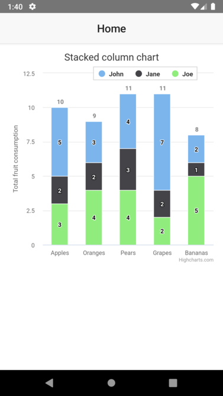
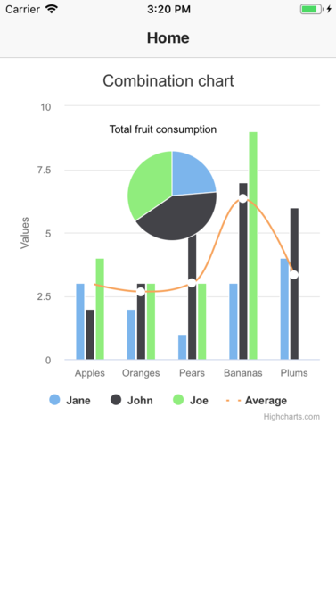
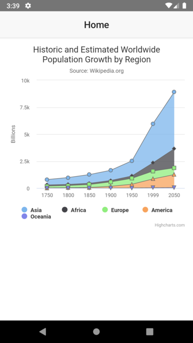
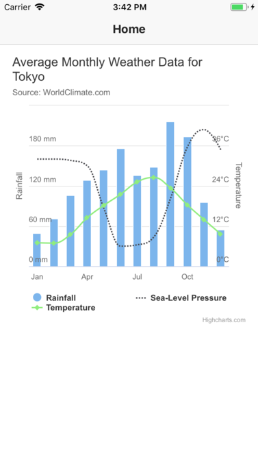
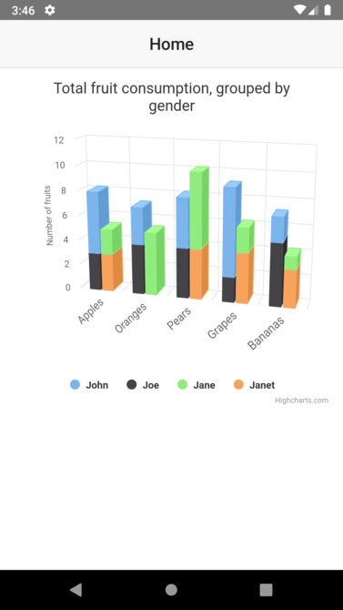
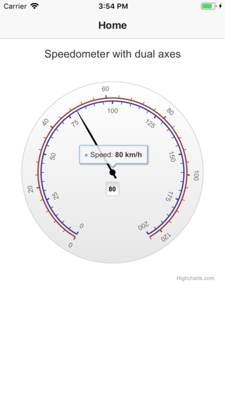
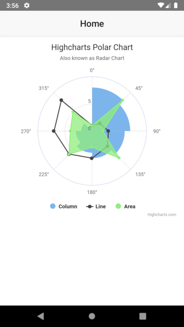
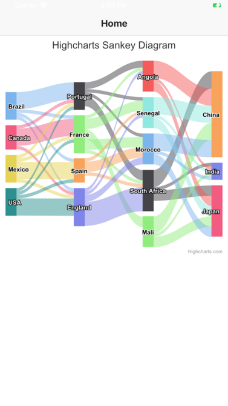
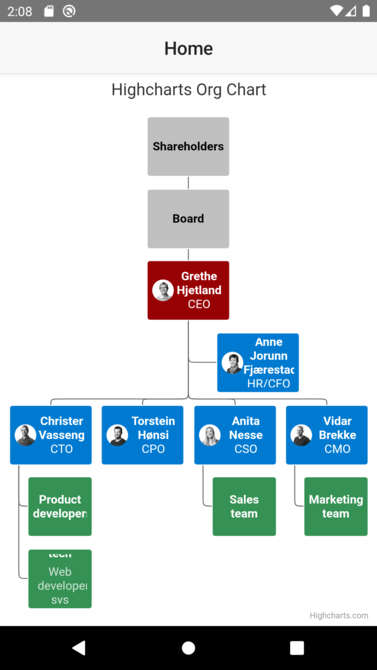

# nativescript-highcharts

This plugins allows you to use Highcharts in NativeScript.

```javascript
ns plugin add @ejaszke/nativescript-highcharts
```

**Info:** This plugin works with NativeScript 7.0.0 and above. For older versions of NativeScript check this [repo](https://github.com/mhtghn/nativescript-ui-highcharts)

## Screenshots

 &nbsp;&nbsp;&nbsp;&nbsp;


 &nbsp;&nbsp;&nbsp;&nbsp;


 &nbsp;&nbsp;&nbsp;&nbsp;


 &nbsp;&nbsp;&nbsp;&nbsp;


 &nbsp;&nbsp;&nbsp;&nbsp;


## Demo apps

### NativeScript-Core (XML)

Check out the [demo](../../apps/demo) folder. This is how to clone and run it:

```bash
git clone https://github.com/mhtghn/ns-plugins.git
cd ns-plugins
npm run setup
npm run start
>   @mhtghn.nativescript-highcharts.build
npm run start
>   apps.demo.ios # or apps.demo.android
```

### NativeScript-Angular

Check out the [demo-angular](../../apps/demo-angular) folder. This is how to clone and run it:

```bash
git clone https://github.com/mhtghn/ns-plugins.git
cd ns-plugins
npm run setup
npm run start
>   @mhtghn.nativescript-highcharts.build
npm run start
>   apps.demo-angular.ios # or apps.demo-angular.android
```

## Usage

### NativeScript-Core

#### TypeScript

Create your Highcharts options object just like you did with plain Highcharts. You can find all the possible options [there](https://api.highcharts.com/highcharts/). Then convert the options to a string because for now you have to pass the options as a string to the plugin.

```typescript
...
export class HomeViewModel extends Observable {
    chartOptions = {
        chart: {
            type: 'column'
        },
        title: {
            text: 'Stacked column chart'
        },
        xAxis: {
            categories: ['Apples', 'Oranges', 'Pears', 'Grapes', 'Bananas']
        },
        yAxis: {
            min: 0,
            title: {
                text: 'Total fruit consumption'
            },
            stackLabels: {
                enabled: true,
                style: {
                    fontWeight: 'bold',
                    color: 'gray'
                }
            }
        },
        legend: {
            align: 'right',
            x: -30,
            verticalAlign: 'top',
            y: 25,
            floating: true,
            backgroundColor: 'white',
            borderColor: '#CCC',
            borderWidth: 1,
            shadow: false
        },
        tooltip: {
            headerFormat: '<b>{point.x}</b><br/>',
            pointFormat: '{series.name}: {point.y}<br/>Total: {point.stackTotal}'
        },
        plotOptions: {
            column: {
                stacking: 'normal',
                dataLabels: {
                    enabled: true
                }
            }
        },
        series: [{
            name: 'John',
            data: [5, 3, 4, 7, 2]
        }, {
            name: 'Jane',
            data: [2, 2, 3, 2, 1]
        }, {
            name: 'Joe',
            data: [3, 4, 4, 2, 5]
        }]
    };

    get chartOptionsString(): string {
        return JSON.stringify(this.chartOptions);
    }
    ...
}
```

#### XML

```xml
<Page class="page"
    navigatingTo="onNavigatingTo"
    xmlns="http://schemas.nativescript.org/tns.xsd"
    xmlns:ui="@mhtghn/nativescript-highcharts">

    <ActionBar class="action-bar">
        <Label class="action-bar-title" text="Home"></Label>
    </ActionBar>

    <GridLayout>
        <!-- Add your page content here -->
        <ui:Highcharts options="{{chartOptionsString}}"></ui:Highcharts>
    </GridLayout>
</Page>
```

### NativeScript Angular

#### TypeScript

Import the HighchartsModule in your module.

```typescript
...
import { HighchartsModule } from '@mhtghn/nativescript-highcharts/angular';

@NgModule({
    imports: [
        ...
        HighchartsModule
    ],
    ...
})
export class HomeModule { }
```

Create your Highcharts options object just like you did with plain Highcharts. You can find all the possible options [there](https://api.highcharts.com/highcharts/). Then convert the options to a string because for now you have to pass the options as a string to the plugin.

```typescript
import { Component, OnInit } from "@angular/core";

@Component({
    selector: "Home",
    moduleId: module.id,
    templateUrl: "./home.component.html"
})
export class HomeComponent implements OnInit {
    chartOptions = {
        chart: {
            type: 'column'
        },
        title: {
            text: 'Stacked column chart'
        },
        xAxis: {
            categories: ['Apples', 'Oranges', 'Pears', 'Grapes', 'Bananas']
        },
        yAxis: {
            min: 0,
            title: {
                text: 'Total fruit consumption'
            },
            stackLabels: {
                enabled: true,
                style: {
                    fontWeight: 'bold',
                    color: 'gray'
                }
            }
        },
        legend: {
            align: 'right',
            x: -30,
            verticalAlign: 'top',
            y: 25,
            floating: true,
            backgroundColor: 'white',
            borderColor: '#CCC',
            borderWidth: 1,
            shadow: false
        },
        tooltip: {
            headerFormat: '<b>{point.x}</b><br/>',
            pointFormat: '{series.name}: {point.y}<br/>Total: {point.stackTotal}'
        },
        plotOptions: {
            column: {
                stacking: 'normal',
                dataLabels: {
                    enabled: true
                }
            }
        },
        series: [{
            name: 'John',
            data: [5, 3, 4, 7, 2]
        }, {
            name: 'Jane',
            data: [2, 2, 3, 2, 1]
        }, {
            name: 'Joe',
            data: [3, 4, 4, 2, 5]
        }]
    };

    get chartOptionsString(): string {
        return JSON.stringify(this.chartOptions);
    }
    ...
}
```

#### HTML

```HTML
<ActionBar class="action-bar">
<ActionBar class="action-bar">
    <Label class="action-bar-title" text="Home"></Label>
</ActionBar>

<GridLayout class="page">
    <!-- Add your page content here -->
    <Highcharts options="{{chartOptionsString}}"></Highcharts>
</GridLayout>
```

## Highcharts Compatibility

- highcharts.js: v8.2.0
- highcharts-more.js: v8.2.0
- highcharts-3d.js: v8.2.0
- sankey.js: v8.2.0
- organization.js: v8.2.0

## Tips

- Add the next option to the chart options to disable the display of the Highcharts.com Hyperlink in the webview
  ```javascript
  credits: {
  	enabled: false;
  }
  ```

## Credit

This plugin is greatly inspired by [this demo](https://github.com/EddyVerbruggen/nativescripthighcharts) from [Eddy Verbruggen](https://github.com/EddyVerbruggen)

## License

Apache License Version 2.0
